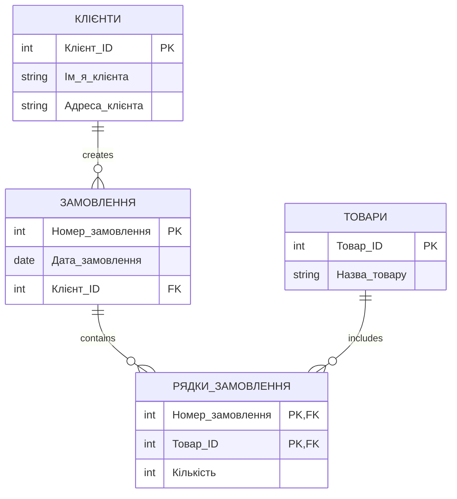
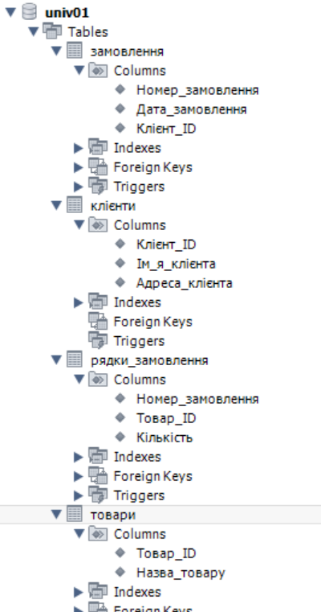

# Нормалізація бази даних замовлень

## Початкова таблиця

| Номер_замовлення | Назва_товару і кількість | Адреса_клієнта | Дата_замовлення | Клієнт |
|-|-|-|-|-|
| 101 | Лептоп: 3, Мишка: 2 | Хрещатик 1    | 2023-03-15 | Мельник |
| 102 | Принтер: 1          | Басейна 2     | 2023-03-16 | Шевченко |
| 103 | Мишка: 4            | Комп'ютерна 3 | 2023-03-17 | Коваленко |

Проблеми: Повторювані групи в одному полі, транзитивні залежності

---

## 1НФ

| 🗝️ Номер_замовлення | 🗝️ Назва_товару | Кількість | Адреса_клієнта | Дата_замовлення | Клієнт |
|-|-|-|-|-|-|
| 101 | Лептоп  | 3 | Хрещатик 1    | 2023-03-15 | Мельник |
| 101 | Мишка   | 2 | Хрещатик 1    | 2023-03-15 | Мельник |
| 102 | Принтер | 1 | Басейна 2     | 2023-03-16 | Шевченко |
| 103 | Мишка   | 4 | Комп'ютерна 3 | 2023-03-17 | Коваленко |
---

## 2НФ

### Таблиця `Замовлення`:

| 🗝️ Номер_замовлення | Дата_замовлення | Клієнт | Адреса_клієнта |
|-|-|-|-|
| 101 | 2023-03-15 | Мельник   | Хрещатик 1 |
| 102 | 2023-03-16 | Шевченко  | Басейна 2 |
| 103 | 2023-03-17 | Коваленко | Комп'ютерна 3 |

### Таблиця `Рядки_замовлення`:

| 🗝️🔗 Номер_замовлення | 🗝️ Назва_товару | Кількість |
|-|-|-|
| 101 | Лептоп | 3 |
| 101 | Мишка | 2 |
| 102 | Принтер | 1 |
| 103 | Мишка | 4 |

---

## 3НФ

### Таблиця `Клієнти`:

| 🗝️ Клієнт_ID | Ім'я_клієнта | Адреса_клієнта |
|-----------|--------------|----------------|
| 1 | Мельник | Хрещатик 1 |
| 2 | Шевченко | Басейна 2 |
| 3 | Коваленко | Комп'ютерна 3 |

### Таблиця `Замовлення`:

| 🗝️Номер_замовлення | Дата_замовлення | 🔗 Клієнт_ID |
|------------------|-----------------|-----------|
| 101 | 2023-03-15 | 1 |
| 102 | 2023-03-16 | 2 |
| 103 | 2023-03-17 | 3 |

### Таблиця `Товари`:

| 🗝️ Товар_ID | Назва_товару |
|----------|--------------|
| 1 | Лептоп |
| 2 | Мишка |
| 3 | Принтер |

### Таблиця `Рядки_замовлення`:

| 🗝️ Номер_замовлення | 🔗 Товар_ID | Кількість |
|------------------|----------|-----------|
| 101 | 1 | 3 |
| 101 | 2 | 2 |
| 102 | 3 | 1 |
| 103 | 2 | 4 |

